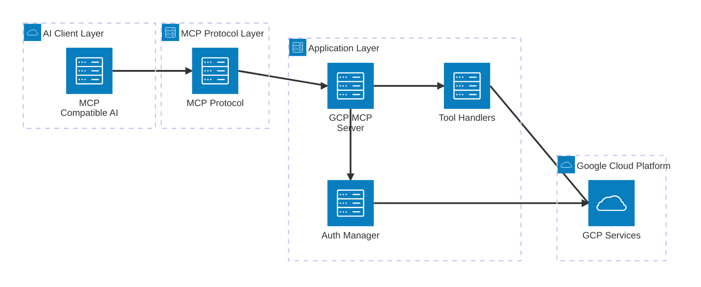
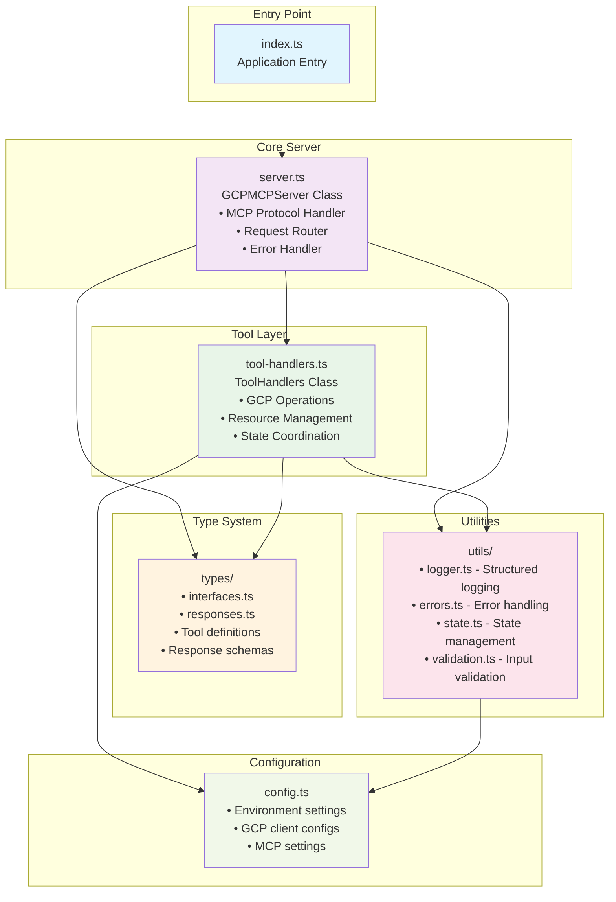
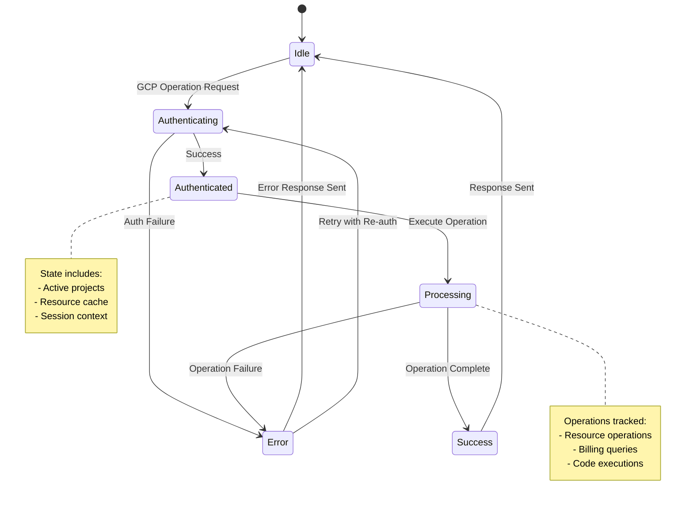
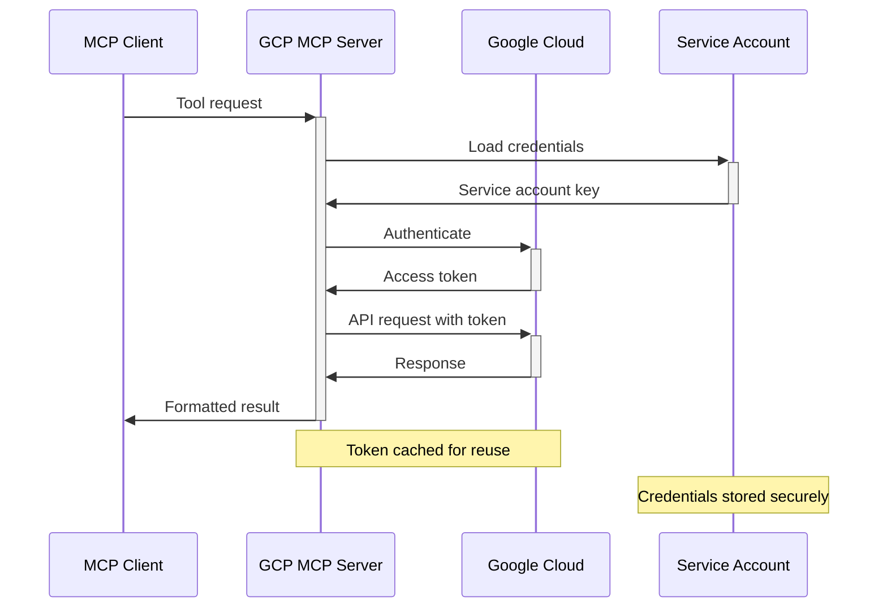

# GCP MCP Server - Architecture Documentation

## Overview

The **GCP MCP Server** is a sophisticated Model Context Protocol (MCP) server that enables **any MCP-compatible AI assistant** to interact with Google Cloud Platform resources seamlessly. Built with TypeScript and following modern software architecture principles, it provides a robust, scalable, and maintainable solution for GCP resource management through conversational AI.

### Supported AI Clients

- **Claude Desktop** (Anthropic)
- **Cursor** (AI code editor)
- **Windsurf** (AI development environment)
- **Custom MCP clients** (enterprise applications)
- **Any future MCP-compatible AI assistants**

### MCP Protocol Universality

This server implements the **Model Context Protocol (MCP)** standard, making it compatible with any AI assistant that supports MCP. The server is **client-agnostic** and focuses on providing GCP functionality through the standardized MCP interface, rather than being tied to any specific AI platform.

#### Key MCP Features:

- **Standardized Tool Discovery** - Dynamic tool registration following MCP specs
- **Type-Safe Communication** - JSON-RPC based protocol with full type safety
- **Universal Compatibility** - Works with any MCP-compatible client
- **Future-Proof Design** - Supports upcoming MCP implementations

## Architecture Diagrams

### 1. High-Level System Architecture



### 2. Application Layer Architecture



### 3. MCP Protocol Flow

````mermaid
sequenceDiagram
    participant AI as MCP-Compatible AI
    participant MCP as MCP Transport
    participant Server as GCP MCP Server
    participant Handler as Tool Handler
    participant GCP as Google Cloud

    Note over AI, GCP: Tool Discovery Phase
    AI->>+MCP: list_tools request
    MCP->>+Server: list_tools()
    Server->>-MCP: Available tools list
    MCP->>-AI: Tool definitions

    Note over AI, GCP: Tool Execution Phase
    AI->>+MCP: call_tool request
    MCP->>+Server: handleToolCall()
    Server->>+Handler: executeOperation()

    alt Authentication Required
        Handler->>+GCP: Authenticate
        GCP->>-Handler: Auth token
    end

    Handler->>+GCP: API Request
    GCP->>-Handler: Response data
    Handler->>-Server: Formatted result
    Server->>-MCP: Tool response
    MCP->>-AI: Operation result

    Note over AI, GCP: Error Handling
    alt Error Occurs
        GCP-->>Handler: Error response
        Handler-->>Server: Structured error
        Server-->>MCP: Error details
        MCP-->>AI: User-friendly error
    end
```### 4. GCP Services Integration

```mermaid
flowchart LR
    subgraph "GCP MCP Server"
        TH[Tool Handlers]
        AM[Auth Manager]
        SM[State Manager]
    end

    subgraph "Google Cloud Services"
        subgraph "Compute"
            CE[Compute Engine]
            GKE[Kubernetes Engine]
            CR[Cloud Run]
            CF[Cloud Functions]
        end

        subgraph "Storage & Data"
            CS[Cloud Storage]
            BQ[BigQuery]
            SQL[Cloud SQL]
        end

        subgraph "Operations"
            LG[Cloud Logging]
            MON[Cloud Monitoring]
            RES[Resource Manager]
        end

        subgraph "Security & Billing"
            IAM[Identity & Access Management]
            BILL[Cloud Billing]
            SEC[Security Center]
        end
    end

    TH --> CE
    TH --> GKE
    TH --> CR
    TH --> CF
    TH --> CS
    TH --> BQ
    TH --> SQL
    TH --> LG
    TH --> MON
    TH --> RES
    TH --> BILL

    AM --> IAM
    AM --> SEC

    SM -.-> LG
    SM -.-> MON

    classDef server fill:#e3f2fd
    classDef compute fill:#e8f5e8
    classDef storage fill:#fff3e0
    classDef operations fill:#f3e5f5
    classDef security fill:#fce4ec

    class TH,AM,SM server
    class CE,GKE,CR,CF compute
    class CS,BQ,SQL storage
    class LG,MON,RES operations
    class IAM,BILL,SEC security
````

## Detailed Component Analysis

### Core Components

#### 1. **Entry Point (`src/index.ts`)**

- **Purpose**: Clean application bootstrap
- **Responsibilities**:
  - Server initialization
  - Graceful shutdown handling
  - Error boundary setup
- **Key Features**:
  - Minimal footprint (16 lines)
  - Proper async/await handling
  - Process signal management

#### 2. **MCP Server (`src/server.ts`)**

- **Purpose**: MCP protocol implementation and request orchestration
- **Responsibilities**:
  - MCP protocol compliance
  - Tool request routing
  - Response formatting
  - Error standardization
- **Key Features**:
  - Type-safe tool handling
  - Comprehensive error catching
  - Structured logging integration
  - State management coordination

#### 3. **Tool Handlers (`src/tools/handlers.ts`)**

- **Purpose**: GCP operation execution engine
- **Responsibilities**:
  - GCP API interactions
  - Resource lifecycle management
  - State coordination
  - Result formatting
- **Key Features**:
  - Modular operation design
  - Comprehensive error handling
  - State-aware processing
  - Consistent response formatting

### Supporting Infrastructure

#### 4. **Type System (`src/types/`)**

- **interfaces.ts**: Core type definitions
- **responses.ts**: Response schemas and validation
- **Purpose**: Type safety and API contracts
- **Benefits**:
  - Compile-time error detection
  - IDE autocomplete support
  - API documentation generation
  - Runtime validation support

#### 5. **Utilities (`src/utils/`)**

- **logger.ts**: Structured logging with context
- **errors.ts**: Error classification and handling
- **state.ts**: Application state management
- **validation.ts**: Input/output validation
- **Purpose**: Cross-cutting concerns and shared functionality

#### 6. **Configuration (`src/config.ts`)**

- **Purpose**: Centralized configuration management
- **Features**:
  - Environment-based configuration
  - GCP client initialization
  - MCP server settings
  - Validation and defaults

## Data Flow Architecture

### Request Processing Pipeline

```mermaid
flowchart TD
    A[MCP Request] --> B{Request Type}

    B -->|list_tools| C[Return Tool Definitions]
    B -->|call_tool| D[Validate Tool Request]

    D --> E{Tool Exists?}
    E -->|No| F[Return Error]
    E -->|Yes| G[Extract Parameters]

    G --> H{Parameters Valid?}
    H -->|No| F
    H -->|Yes| I[Load State Context]

    I --> J[Execute GCP Operation]
    J --> K{Operation Success?}
    K -->|No| L[Format Error Response]
    K -->|Yes| M[Format Success Response]

    L --> N[Update State]
    M --> N
    N --> O[Log Operation]
    O --> P[Return Response]

    classDef success fill:#e8f5e8
    classDef error fill:#ffebee
    classDef process fill:#e3f2fd
    classDef decision fill:#fff3e0

    class C,M,P success
    class F,L error
    class I,J,N,O process
    class B,E,H,K decision
```

### State Management Flow



## Design Patterns & Principles

### 1. **Modular Architecture**

- **Separation of Concerns**: Each module has a single responsibility
- **Dependency Injection**: Configurable dependencies
- **Interface Segregation**: Focused, minimal interfaces

### 2. **Error Handling Strategy**

- **Hierarchical Error Types**: Structured error classification
- **Graceful Degradation**: Partial failures don't break the system
- **User-Friendly Messages**: Technical errors translated to actionable feedback

### 3. **State Management**

- **Immutable State**: State changes through pure functions
- **Context Preservation**: Operation context maintained across requests
- **Cache Strategy**: Intelligent caching for performance optimization

### 4. **Security & Authentication**

- **Service Account Authentication**: Secure GCP API access
- **Least Privilege Principle**: Minimal required permissions
- **Credential Management**: Secure storage and rotation

## Performance Characteristics

### Scalability Factors

1. **Memory Usage**
   - Minimal memory footprint at idle
   - Efficient state management
   - Garbage collection friendly patterns

2. **Response Times**
   - Cached authentication tokens
   - Connection pooling for GCP APIs
   - Asynchronous operation handling

3. **Concurrency**
   - Thread-safe state management
   - Non-blocking I/O operations
   - Parallel request processing capability

### Resource Management

- **Connection Pooling**: Reuse of GCP client connections
- **State Cleanup**: Automatic cleanup of stale state
- **Memory Monitoring**: Built-in memory usage tracking
- **Error Recovery**: Automatic retry with exponential backoff

## Security Architecture

### Authentication Flow



### Security Controls

1. **Access Control**
   - Service account based authentication
   - Project-level permission scoping
   - Resource-level access validation

2. **Data Protection**
   - No sensitive data persistence
   - Secure credential handling
   - Encrypted API communications

3. **Audit & Monitoring**
   - Comprehensive operation logging
   - Error tracking and alerting
   - Usage pattern monitoring

## Deployment Architecture

### Development Environment

```
┌─────────────────┐    ┌─────────────────┐    ┌─────────────────┐
│   AI Client     │    │  Local Server   │    │   GCP Project   │
│                 │    │                 │    │                 │
│ MCP Integration │◄──►│  MCP Server     │◄──►│  API Endpoints  │
│                 │    │  (Development)  │    │                 │
└─────────────────┘    └─────────────────┘    └─────────────────┘
```

### Production Deployment

```
┌─────────────────┐    ┌─────────────────┐    ┌─────────────────┐
│   AI Assistant  │    │  NPM Package    │    │   GCP Project   │
│                 │    │                 │    │                 │
│ MCP Integration │◄──►│  gcp-mcp-server │◄──►│  Production     │
│                 │    │  (Published)    │    │  Resources      │
└─────────────────┘    └─────────────────┘    └─────────────────┘
```

## Future Architecture Considerations

### Extensibility Points

1. **Plugin System**: Support for custom GCP operations
2. **Multi-Cloud**: Extend to AWS/Azure with similar patterns
3. **Caching Layer**: Redis/Memcached for large-scale deployments
4. **Event System**: Webhook support for real-time updates

### Scalability Enhancements

1. **Microservices**: Split into domain-specific services
2. **Load Balancing**: Horizontal scaling capabilities
3. **Database Integration**: Persistent state for enterprise use
4. **Monitoring**: Advanced observability and metrics

---

## Related Documentation

- [Project Analysis](./PROJECT_ANALYSIS.md) - Detailed code analysis
- [Restructuring Summary](./RESTRUCTURING_SUMMARY.md) - Migration details
- [Usage Guide](./README.md) - Implementation and usage
- [Improvements Roadmap](./IMPROVEMENTS.md) - Future enhancements

---

_This architecture documentation provides a comprehensive view of the GCP MCP Server's design, implementation, and operational characteristics. It serves as a reference for developers, architects, and operators working with the system._
